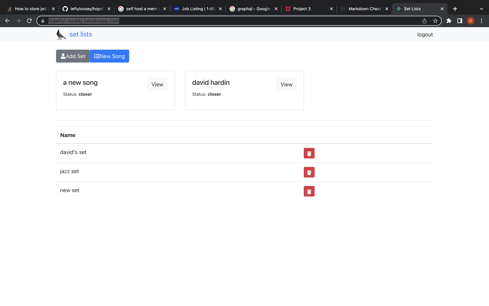

<!-- ## Project 3 - Simple MERN Stack

### Set Lists

This is a simple React app. Mongoose, Apollo etc. It's got an express-graphql schema 
overlaying the database, which is intentionally simple for to serve as a kind of stem 
cell for other applications. Right now it's acting as a set list organiser for musicians 
who want to group their songs into different orders while performing. 

But the idea is that I can scale it up and out to become many potential things. 
It could be a blog, a messageboard, a recipe site. Etc. The hard part of getting 
all the components to talk to each other is worked out. The database supports 
set and song and user, which authenticates with a json webtoken, but could 
potentially these could be anything. 

Link:
[heroku](https://hopeful-muddy.herokuapp.com/)

Screen:
 -->

## sandbox 

this is a sandbox. here, that other little MERN stack I wrote for school will 
become an insurance website for my in-laws.
